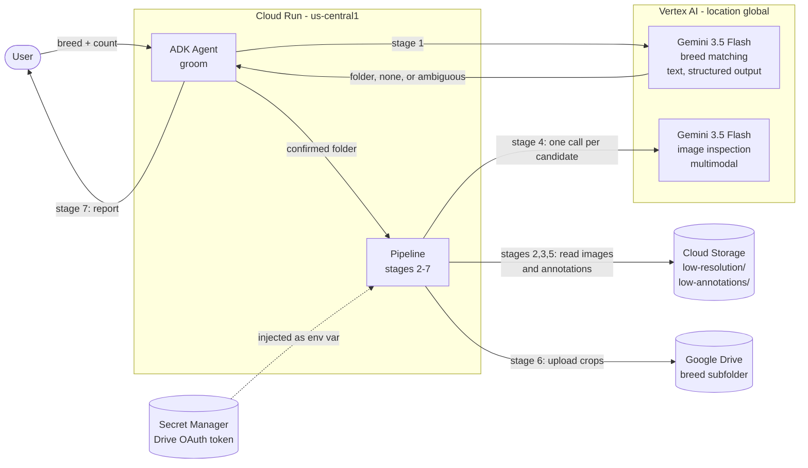
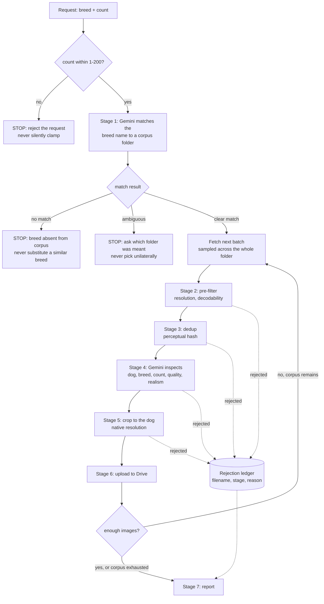

# Groom
An autonomous agent that curates ML training datasets — sources images, inspects each one with Gemini, deduplicates, preprocesses, and files the keepers.

> Curating a training dataset means reviewing hundreds of images by hand. This agent looks at every photo, rejects what won't help, and files the rest.

Built for the [All Things Agentic Hackathon](https://allthingsagentichackathon.devpost.com/) — **Taskmaster** track.

## The problem

I maintain a dog breed recognition app with an on-device model trained on 117 breeds. Expanding it means more training data, and preparing a batch looks like this: download a few hundred images per breed, open them, delete the ones with no dog, delete the ones with five dogs, delete the blurry ones and the studio shots that look nothing like what users actually photograph, find the near-duplicates, crop and resize what survived, move it into the right folder. Then repeat for the next breed.

Hours of clicking, none of it engineering — and mistakes are invisible. A mislabeled image doesn't crash anything, it just quietly makes the model worse.

## What Groom does

Given a request like `100 Dalmatian images`, the agent runs a multi-stage pipeline without supervision:

1. **Source** — pulls candidates for the requested breed from the Tsinghua Dogs corpus in Cloud Storage
2. **Pre-filter** — drops images below resolution and format thresholds
3. **Deduplicate** — perceptual hashing catches near-identical shots, not just byte-identical files
4. **Inspect** — Gemini looks at each surviving image and judges it against training-quality criteria
5. **Process** — crops to the annotated dog, at native resolution
6. **File** — writes to the correct breed folder in Google Drive
7. **Report** — summarizes what was kept, what was rejected, and why

### Inspection criteria

- Is there actually a dog in frame?
- Does it match the requested breed? (public datasets contain mislabeled images)
- Is there a single subject? (multiple dogs introduce label ambiguity)
- Is it usable — sharp enough, lit well enough, dog large enough in frame?
- **Does it match deployment conditions?** Users photograph dogs with phones, outdoors, in poor conditions. Studio shots with clean backgrounds are technically good photos and practically bad training data. Groom rejects them on purpose.

The agent decides what gets rejected. The human decides what gets trained — every rejection is logged with its reason.

## Architecture



**Two identities, on purpose.** Cloud Storage and Vertex AI are reached with the
Cloud Run **service account**. Drive is reached as the **user**, through an
OAuth token from Secret Manager — a service account has no Drive storage quota
and cannot upload files at all. No service account key file exists anywhere in
the project.

### Pipeline flow



Three of the boxes above are **stops**, not errors. Refusing an out-of-range
count, an absent breed, or an ambiguous one is the designed behaviour: a wrong
breed silently poisons a training set and nothing downstream can detect it.

Rejections are never discarded — every one carries its filename, the stage that
turned it down, and why, and the report groups them by stage and reason so the
counts reconcile exactly against candidates examined.

## Stack

- **Gemini 3.5 Flash** via Vertex AI — breed matching and multimodal image inspection
- **Google ADK** — agent orchestration and tool registration
- **Cloud Run** — deployed service
- **Cloud Storage** — source image corpus
- **Google Drive API** — output destination
- **Secret Manager** — Drive OAuth token for the deployed service
- **Python 3.12**, Pillow, ImageHash

## Status

🚧 In active development for the hackathon submission period (August 2026).

## Setup

Requires **Python 3.11 or 3.12**. Do not use 3.14 — several dependencies are not
reliably tested there.

```bash
python3.12 -m venv .venv
source .venv/bin/activate
pip install -r requirements.txt

cp .env.example .env    # then fill in your project, bucket and Drive folder
```

### Credentials

Nothing reads a key file. Locally the agent uses your Application Default
Credentials; on Cloud Run it uses the attached service account.

**Drive is the exception.** A service account has no Drive storage quota, so it
cannot upload files at all — the fixes Google suggests (shared drives, OAuth
delegation) both need Google Workspace. Drive therefore runs as *your* user
account through a stored OAuth token, created once:

```bash
python scripts/authorize_drive.py    # opens a browser, writes drive_token.json
```

That needs an OAuth client from the Cloud console first; the script's docstring
and [`commands.md`](commands.md) walk through it. The token refreshes itself,
but expires after 7 days while the consent screen is in Testing mode — re-run
the script if uploads start failing.

`DRIVE_OUTPUT_FOLDER_ID` must be a folder the authorized account can reach —
normally one you own. A folder that account cannot see reports as *not found*
rather than as a permission error, which is a confusing way to learn this.

### The corpus

Groom reads from your own bucket; there is no shared one. Download
[Tsinghua Dogs](https://cg.cs.tsinghua.edu.cn/ThuDogs/) from the authors and
upload both trees, keeping the folder names as published:

```bash
gcloud storage cp -r "low-resolution/<breed-folder>"  gs://$GCS_BUCKET_NAME/low-resolution/
gcloud storage cp -r "low-annotations/<breed-folder>" gs://$GCS_BUCKET_NAME/low-annotations/
```

One breed folder is enough to run everything end to end. Any corpus of images
with Pascal-VOC bounding boxes works — nothing is specific to this dataset.

### Run

```bash
adk run ./src        # terminal
adk web              # browser UI, pick the "groom" agent
```

Every stage is importable and runnable on its own, without the agent:

```python
from src.pipeline import run_pipeline
from src import report

run = run_pipeline("Alaskan Malamute", 25, "1324-n000004-malamute")
print(report.render_text(run))
```

### Verifying it works

There is no test suite. These checks are what the behaviour was actually
verified against, and each one exercises a different guarantee.

**It refuses rather than guesses.** In `adk web`, ask for a breed the corpus
does not contain (`"I need 10 Poodle images"`). It must say the breed is absent
and offer what is available — never substitute a similar breed. Ask for more
than `MAX_IMAGES_PER_REQUEST` and it must reject the request, not trim it.

**Inspection actually rejects.** Real corpora are cleaner than you expect, so a
working filter and a dead one can produce identical counts. Feed it constructed
failures instead:

```python
from src.inspection import inspect_image
inspect_image(open("blurred.jpg", "rb").read(), "Siberian Husky")
# -> keep=False, category="unusable quality"
```

A heavily blurred image, a near-black one, a two-dog composite and a crop of
empty background should each come back rejected with the matching category.

**The counts reconcile.** For any run,
`kept + len(rejections) + unused_surplus == candidates_examined`. If that stops
holding, a stage is dropping candidates silently.

**The crops are right.** Open several outputs. The dog should be whole, not cut
at the edges, not distorted, with margin around it, and the short side never
below `TRAINING_INPUT_SIZE`.

**Re-running is safe.** Issue the same request twice. The Drive folder must end
up with the same number of files, not double.

### Deploy

```bash
adk deploy cloud_run \
  --project=$GOOGLE_CLOUD_PROJECT \
  --region=us-central1 \
  --service_name=groom \
  --app_name=groom \
  --with_ui \
  ./src
```

Local `.env` values do not travel into the container — set them on the service
explicitly. See [`commands.md`](commands.md) for the full command reference.

> **Cloud Run region is not the Vertex AI location.** Cloud Run needs a real
> region (`us-central1`); Gemini 3.5 is served only from `global`.

## Output format

Images are cropped to the annotated `bodybndbox` plus a 10% margin and saved at
**native resolution and natural aspect ratio** — no resize, no square crop.

A crop whose short side falls below `TRAINING_INPUT_SIZE` (224px, the training
code's `IMG_SIZE`) is rejected rather than filed, because reaching 224 from
below means upscaling, which invents detail instead of supplying it. This
catches what the source pre-filter cannot: a large photo of a small, distant
dog.

How much it removes depends on `CROP_PADDING_RATIO`, since the margin is what
lifts a marginal crop over the line — about 12% of otherwise-good candidates at
the current 0.25. The pipeline absorbs the loss by examining more of the
folder.

The training code does its own resize, so resizing here would resample twice
and bake one target resolution into every file. It also used to force
non-square crops into a square, which meant padding with black bars on roughly
half of all images; dropping the square requirement removed that entirely.

To go back to fixed-size square output, set `OUTPUT_SIZE` in `src/config.py` to
an int. Nothing else needs to change.

## Inspection

Stage 4 sends each surviving image to Gemini and asks whether it belongs in the
training set: is there a dog, is it the requested breed, is there only one, is
it sharp and lit well enough, is it a real photograph, and does it look like
something a phone camera would produce rather than a studio setup.

It runs on the **full image, before cropping**, on purpose — the body box
frames a single dog, so cropping first would hide the second and third dog in
the frame.

Rejections carry a fixed category (`wrong breed`, `no dog`, `multiple dogs`,
`unusable quality`, `not a photograph`, `studio shot`) plus the model's own
wording, so the report counts by kind while each rejection keeps its
explanation.

Measured on Tsinghua Dogs at ~1,080 input tokens and ~50 output tokens per
image, around 0.5s per image at concurrency 8. Because that corpus is already
curated, the pass rate is high (~96%) and nearly all rejections are mislabelled
breeds — the value here is catching the images that would silently teach the
model the wrong thing. On an uncurated web scrape the quality criteria would do
far more work.

## Data source and attribution

The source corpus is **Tsinghua Dogs**, published by Tsinghua University: 130
dog breeds with per-image bounding box annotations for body and head.

The authors distribute it publicly for research and ask that the paper be cited.
They publish no licence text, so no broader permission should be assumed from
its availability. This project does not redistribute the dataset — the images
live in a private Cloud Storage bucket, and only derived crops are written to
the operator's own Drive. Anyone wanting the corpus should get it from the
authors directly at https://cg.cs.tsinghua.edu.cn/ThuDogs/.

```bibtex
@article{Zou2020ThuDogs,
  title={A new dataset of dog breed images and a benchmark for fine-grained classification},
  author={Zou, Ding-Nan and Zhang, Song-Hai and Mu, Tai-Jiang and Zhang, Min},
  journal={Computational Visual Media},
  year={2020},
  url={https://doi.org/10.1007/s41095-020-0184-6}
}
```

Groom is corpus-agnostic in shape: any source with images and Pascal-VOC-style
bounding boxes fits the same pipeline.

## License

MIT — this covers Groom's own source code, and nothing about the dataset it
reads.
